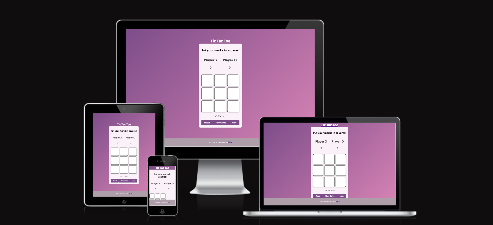

# Introduction
Tic-tac-toe is a paper-and-pencil game for two players who take turns marking the spaces in a three-by-three grid with X or O. The player who succeeds in placing three of their marks in a horizontal, vertical, or diagonal row is the winner. It is a solved game, with a forced draw assuming the best play from both players. If tic-tac-toe were as simple as it seems, then why has it been around for over 3,000 years? The particular JavaScript version of the game has evolved a bit since the original version by letting two kids play online from their computers. From an educational point of view, this classic game contributes to children's development and growth in numerous ways, including their understanding of predictability, problem-solving, spatial reasoning, hand-eye coordination, turn-taking, and strategizing. The purpose of the project is to create a website called "Tic-tac-toe" that serves as an educational game and learning tool. The project aims to provide users with a trustworthy, safe, effective, and interactive platform. Two users are invited to follow the game instructions, then experiment, play for as long as they want, keep their scores, learn, and have fun. Moreover, the user interface UI is entertaining, free to play, and priceless to learn. <a href="https://evapalatou.github.io/tic-tac-toe-2" target="_blank">The website can be accessed HERE!</a>

# User Stories
The users of 'Tic-tac-toe' want to play a fun round of noughts and crosses that is intuitive, has a nice visual design and is quite challenging. Overall, the goal of the site is to spread joy to users in all ages by delivering an intuitive experience via the user interface, nice visual and sound design. 

- As a *first-time visitor*, I want to be able to easily understand the purpose of the website, so I can decide whether I want to use it or not. I want to be able to easily understand the rules of the game, so I can play freely. Last but not least, I want a pretty straightforward interface that explores all the gaming possibilities, I want to feel that I don't waste my limited time, whilst at the same time it is quite entertaining.
- As a *frequent visitor*, I want to be able to track my score when I am playing against the computer so that I can measure my progress. I do not want to feel restricted and I want to play as many rounds as possible. At the same time, I want to invite a second player to join me, thus the game becomes more enjoyable and interesting. Also, I want to acquire skills valuable in every day life, such as problem solving, hand-eye coordination, strategizing etc. I want to be able to compete with other users, so I can motivate myself to play the game. I want to be able to learn interesting facts about the game, so that I can help other people.
- As a *parent or an educator* I want to make sure that the content is safe for children, so I can freely let my child play the game. I want to be sure that the is no advertisement, so I can freely let my child play the game. I want to know that my child develops good recycling habits. I want to be sure that my child is motivated to play the game. 

# Design
### Wireframes
The wireframes created in Marvel App depict the final design and structure of the website.
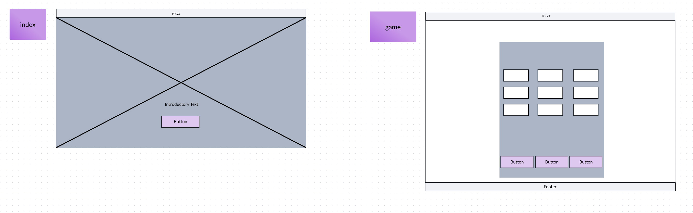

### Color Scheme
The color palette of the website is based on the generic gradient color scheme. Purple is used for the main backfround, cream white for the div containers, and pink, red and yellow for highlighting purposes (i.e. buttons, links, hover effect)
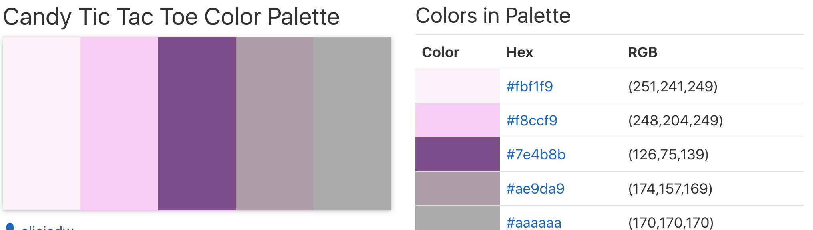

### Typography
The project utilizes the Open Sans font family for typography. Open Sans is a humanist sans serif typeface designed by Steve Matteson, Type Director of Ascender Corp. Open Sans was designed with an upright stress, open forms and a neutral, yet friendly appearance. It was optimized for print, web, and mobile interfaces, and has excellent legibility characteristics in its letterforms. 
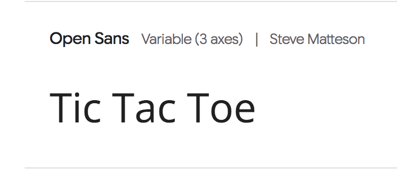

### Audio
The project contains three audio files taken from the <a href="https://pixabay.com/music/" target="_blank">pixabay website</a>. Audio effect enhance the overall gaming experience and make the application more interactive and entertaining. In particular, the default setting for music is set to mute, however if you choose to hear the audio, I provide audio effects specifically for the i) mark move, ii) the winning condition, iii) draw.
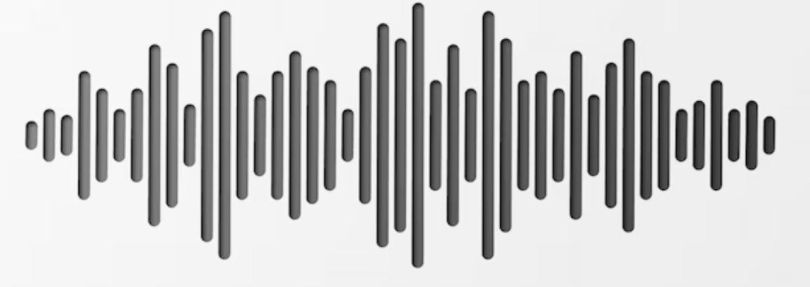

# Features
### Type text animation
The welcome index.html page includes a type text animation with instructions and suggestions about the game. The user has to click the 'Start Game' button in order to redirect to the main game.html page. 
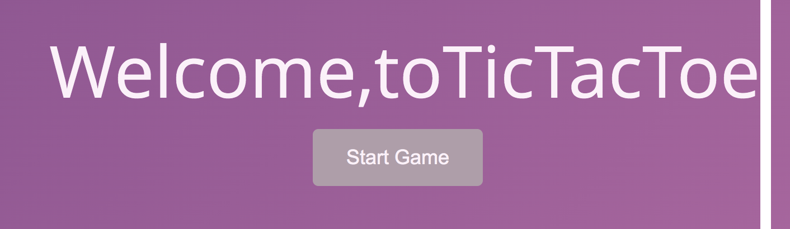

### Modal window
The game loads automatically the second feature of the application, which is a modal that includes detailed instructions for the users. In order to exit the modal, the users have to click either the 'X' symbol and the 'Start Game' button, or click anywhere in the area outside of the modal.
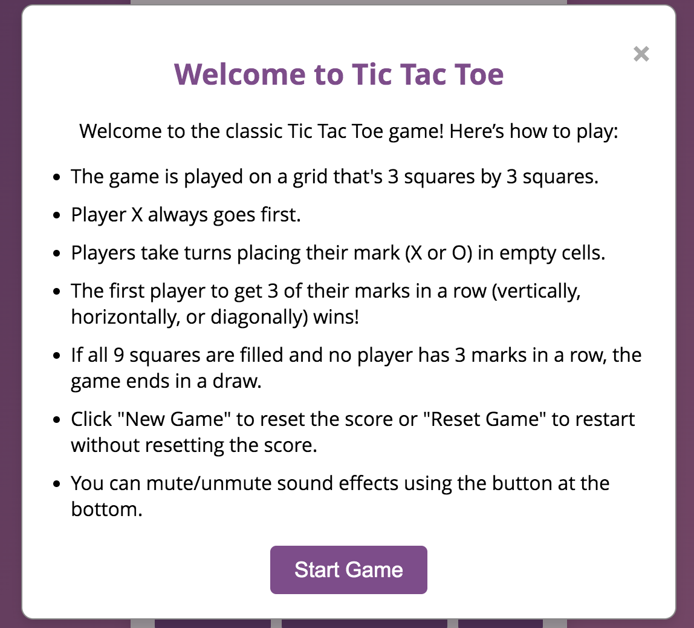

### Score Area
The score area displays the current round's game score and it is constantly updating. Here it is provided information about the score for the player X and player O.

### Game Board 3x3 grid
The game board feature, which is a nine square cells grid and here the actual game takes place. It is important to pinpoint the hover effect and the winning condition animation that make the visual design of the game more interesting.
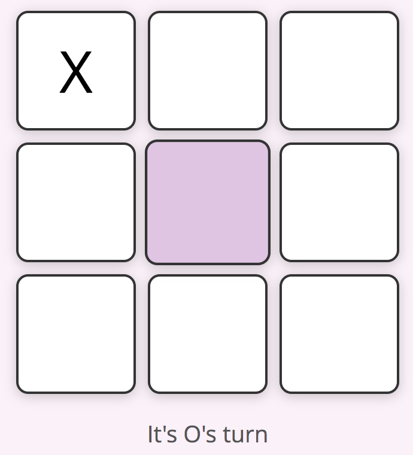

### Animated Buttons
The three buttons area feature includes the buttons shown below that play a crucial role for the game process. i) the 'Refresh' button updates the game board after a game round is finished, ii) the 'New Board' button starts a new round, thus, sets all scores to zero, and iii) the audio icon button, which is set by default to mute. Players may easily toggle between mute/unmute condition. 
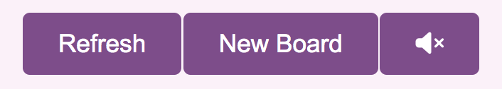

### Footer
The footer feature which includes information about the creator of the game and links to social media channels.

### Error 404 Page
The 404.html page which acts as the "border" of the website for when the user clicks on something broken, then he can simply click to go back to the homepage.
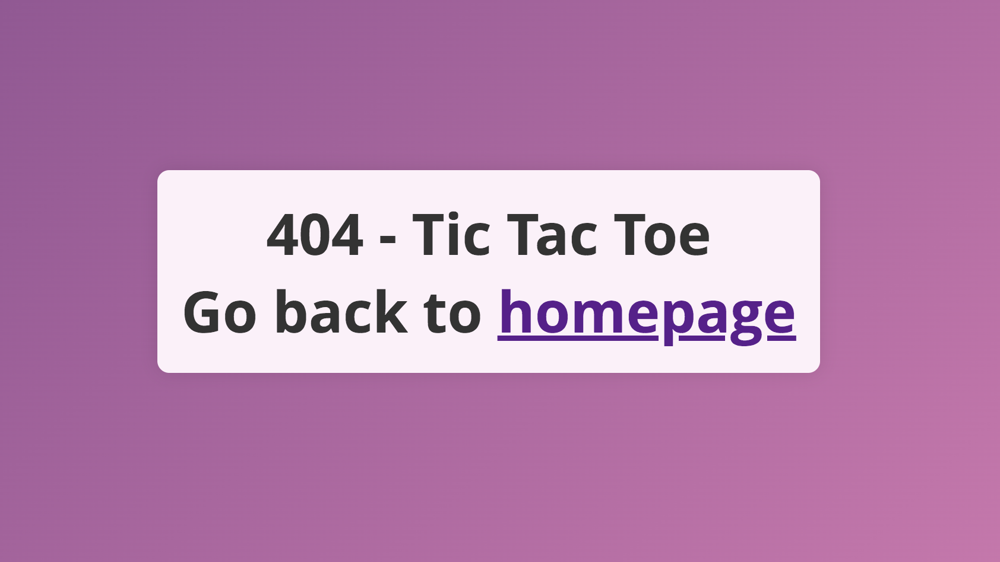

### Future Improvements
- Add a leaderboard with highest scores
- Submit form with the names of the players

# Technologies 
### Languages
- JavaScript - provides the biggest part of the functionality for the application.
- HTML - provides the content and structure for the application.
- CSS - provides the styling for the application.
### Other tools
- Git Used for version control. 
- Github Used as the hosting platform for the code.
- Github Pages Used for deploying the webpage.
- Gitpod Used as the IDE for writing, editing and debugging code.
- Favicon Used for generating the favicon.
- Font awesome Used for the social icons in the footer.
- Am I Responsive Used for checking the responsiveness of the website.
- Lighthouse Used for checking the score for the page through Google Chrome's dev tools on incognito mode
- Browserling online cross-browser testing
- Responsinator.com for checking the responsiveness of the website

# Testing 
### Browser Compatibility
The website was tested on the following browsers: Chrome, Firefox, Opera

Chrome
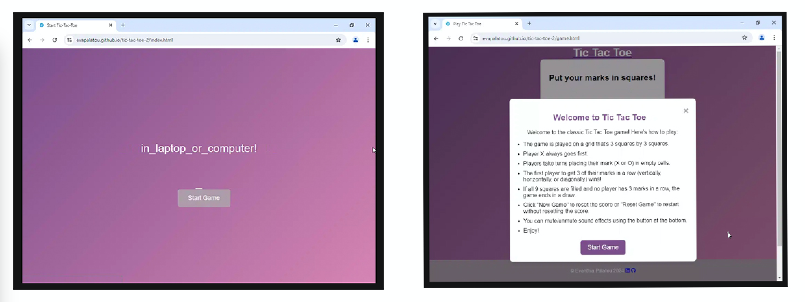
Safari
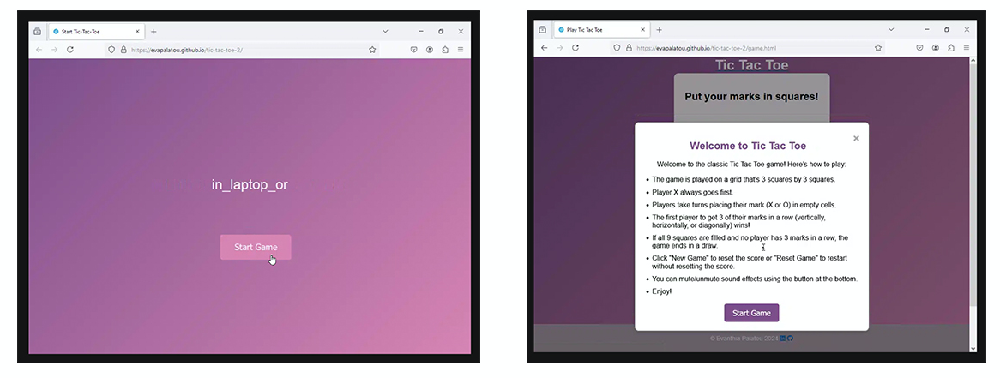
Opera
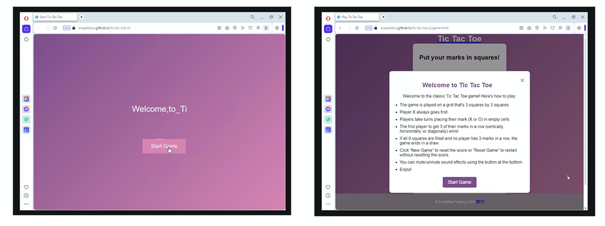

### Responsiveness
The website was checked both by devtools implemented in Chrome browser and the Responsinator Testing Tool (source: http://www.responsinator.com/)
- For the index.html page check <a href="http://www.responsinator.com/?url=https%3A%2F%2Fevapalatou.github.io%2Ftic-tac-toe-2%2F" target="_blank">here!</a>
- For the game.html page check <a href="http://www.responsinator.com/?url=evapalatou.github.io%2Ftic-tac-toe-2%2Fgame.html" target="_blank">here!</a>

### Code Validation
No errors or warnings were found when passing through the official W3C validator (HTML and CSS)
- For the index.html check <a href="https://validator.w3.org/nu/?doc=https%3A%2F%2Fevapalatou.github.io%2Ftic-tac-toe-2%2Findex.html" target="_blank">here!</a>
- For the game.html check <a href="https://validator.w3.org/nu/?doc=https%3A%2F%2Fevapalatou.github.io%2Ftic-tac-toe-2%2Fgame.html" target="_blank">here!</a>
- For the CSS jigsaw validator check <a href="https://jigsaw.w3.org/css-validator/validator?uri=https%3A%2F%2Fevapalatou.github.io%2Ftic-tac-toe-2%2Fassets%2Fcss%2Fstyle.css&profile=css3svg&usermedium=all&warning=1&vextwarning=&lang=en" target="_blank">here!</a>
- For the JavaScript I used the <a href="https://jshint.com/" target="_blank">JSint in es6</a> tool which shows error less result (only a few warnings)

### Features Testing

| Feature | Test case | Outcome |
| --- | --- | --- |
| Welcome Page | Click on the 'Start Game' button | User is brought to the Game Page | 
| Modal Window | Click on the 'X' icon | The user can see the gameboard | 
| Modal Window | Click on the 'Start Game' button | The user can see the gameboard | 
| Logo | Click on the 'Tic Tac Toe' logo | The user is redirected to the welcome page (index.html) | 
| Game Board | Click on an empty cell at the grid | The user marks the area with the sign X or O | 
| Game Board Button | Click on the 'Refresh' button | The user erases the grid from marks after a round is finished |
| Game Board Button | Click on the 'New Board' button | The user starts a new game and scores are set to 0 | 
| Game Board Button | Click on the audio icon | The user activates the sound | 
| Game Board Button | Click on the audio icon | The user de-activates the sound | 
| Footer Linkedin | Click on the Linkedin icon | The user is redirected to the Linkedin page |
| Footer Github | Click on the Github icon | The user is redirected to the Github page |
| Error Page | Click on something that is broken | The user views the 404.html page and has the option to go back to the Welcome Page |

### Lighthouse
Using lighthouse in devtools, it is confirmed that the website is performing well and it is accessible.
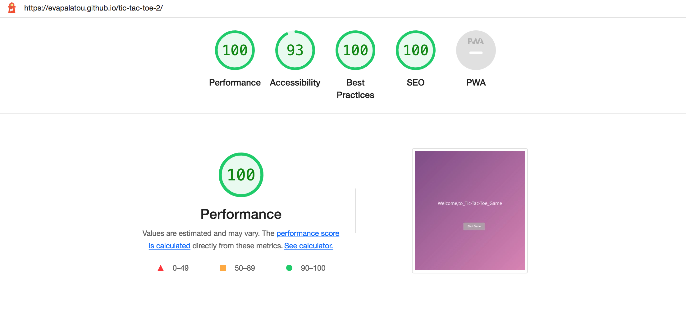
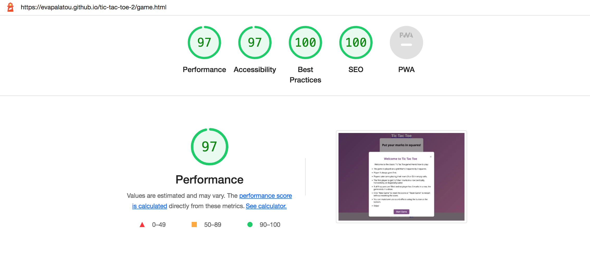

### Bugs
Errors are fixed!

# Deployment
### Via Gitpod
1. Go to your Cloud IDE <a href="https://codeinstitute-ide.net/workspaces" target="_blank">here!</a>
2. Click the button 'New Workspace'
3. Select your repository from the list e.g. tic tac toe 2
4. Click Enter
5. Your current repository can be found <a href="https://github.com/evapalatou/tic-tac-toe-2" target="_blank">here!</a>
### Via Github pages
1. In the GitHub repository, navigate to the Settings tab
2. From the Code and Automation dropdown menu select Pages
3. Select the branch to be main and the folder to be /root
4. Then, click save
5. Follow the <a href="https://evapalatou.github.io/tic-tac-toe-2/" target="_blank">deployed link</a> to the website

# Credits
- Some ideas about code were taken and learned for the tic-tac-toe game: 
<a href="https://www.geeksforgeeks.org/simple-tic-tac-toe-game-using-javascript/" target="_blank">tutorial 1</a>, 
<a href="https://codebrainer.com/blog/tic-tac-toe-javascript-game" target="_blank">tutorial 2</a>,
<a href="https://www.thatsoftwaredude.com/content/6189/step-by-step-guide-to-coding-tic-tac-toe-in-javascript" target="_blank">tutorial 3</a>,
<a href="https://hackr.io/blog/how-to-build-tic-tac-toe-in-javascript" target="_blank">tutorial 4</a>,
<a href="https://www.tutorjoes.in/JS_tutorial/tic_tac_toe_in_js" target="_blank">tutorial 5</a>
- Video tutorials for tic-tac-toe game: <a href="https://www.youtube.com/@BroCodez" target="_blank">Bro Code</a>, <a href="https://www.youtube.com/@DorsCodingSchool/videos" target="_blank">Dors Coding School</a>, <a href="https://www.youtube.com/@conorcoder7196/videos" target="_blank">Conor Coder</a>
- Typewrite animation from Felix Luciano <a href="https://codepen.io/FelixLuciano/pen/PoqdMKP" target="_blank">Codepen website</a>
- Lerning the CSS @keyframes Rule on <a href="https://www.w3schools.com/" target="_blank">W3School</a>
- The icons in the footer were taken from <a href="https://fontawesome.com/" target="_blank">Font Awesome</a>
- Audio effects were downloaded from <a href="https://pixabay.com/music/" target="_blank">Pixabay</a>
- Troubleshooting: <a href="https://stackoverflow.com/" target="_blank">Stack Overflow</a>, <a href="https://developer.mozilla.org/en-US/docs/Web/JavaScript/Guide" target="_blank">MDN</a>

# Acknowledgements
- Iuliia Konovalova, my mentor.
- Code Institute tutors and Slack community members for their support and help.

