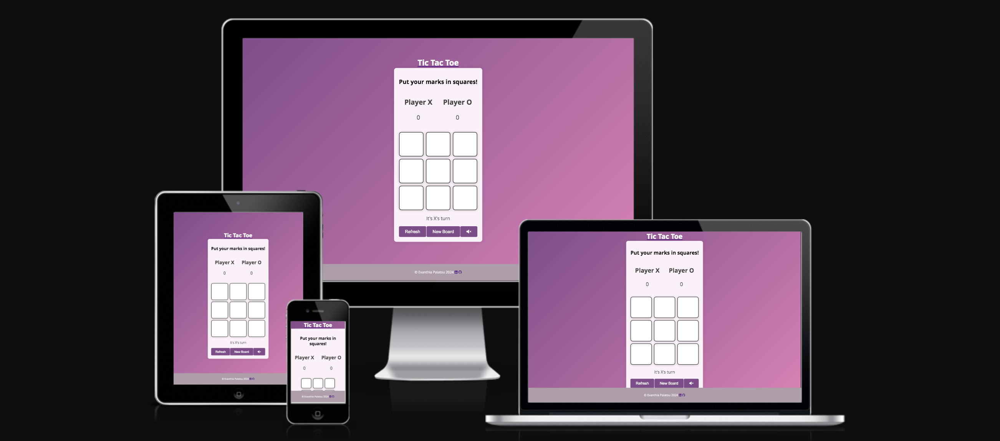

# Introduction
Tic-tac-toe is a paper-and-pencil game for two players who take turns marking the spaces in a three-by-three grid with X or O. The player who succeeds in placing three of their marks in a horizontal, vertical, or diagonal row is the winner. It is a solved game, with a forced draw assuming the best play from both players. If tic-tac-toe were as simple as it seems, then why has it been around for over 3,000 years? The particular JavaScript version of the game has evolved a bit since the original version by letting two kids play online from their computers. From an educational point of view, this classic game contributes to children's development and growth in numerous ways, including their understanding of predictability, problem-solving, spatial reasoning, hand-eye coordination, turn-taking, and strategizing. The purpose of the project is to create a website called "Tic-tac-toe" that serves as an educational game and learning tool. The project aims to provide users with a trustworthy, safe, effective, and interactive platform. Two users are invited to follow the game instructions, then experiment, play for as long as they want, keep their scores, learn, and have fun. Moreover, the user interface UI is entertaining, free to play, and priceless to learn. <a href="https://evapalatou.github.io/tic-tac-toe-2" target="_blank">The website can be accessed HERE!</a>

# User Stories
The users of 'Tic-tac-toe' want to play a fun round of noughts and crosses that is intuitive, has a nice visual design and is quite challenging. Overall, the goal of the site is to spread joy to users in all ages by delivering an intuitive experience via the user interface, nice visual and sound design. 

- As a *first-time visitor*, I want to be able to easily understand the purpose of the website, so I can decide whether I want to use it or not. I want to be able to easily understand the rules of the game, so I can play freely. Last but not least, I want a pretty straightforward interface that explores all the gaming possibilities, I want to feel that I don't waste my limited time, whilst at the same time it is quite entertaining.
- As a *frequent visitor*, I want to be able to track my score when I am playing against the computer so that I can measure my progress. I do not want to feel restricted and I want to play as many rounds as possible. At the same time, I want to invite a second player to join me, thus the game becomes more enjoyable and interesting. Also, I want to acquire skills valuable in every day life, such as problem solving, hand-eye coordination, strategizing etc. I want to be able to compete with other users, so I can motivate myself to play the game. I want to be able to learn interesting facts about the game, so that I can help other people.
- As a *parent or an educator* I want to make sure that the content is safe for children, so I can freely let my child play the game. I want to be sure that the is no advertisement, so I can freely let my child play the game. I want to know that my child develops good recycling habits. I want to be sure that my child is motivated to play the game. 

# Design
### Wireframes
The wireframes created in Marvel App depict the final design and structure of the website.

### Color Scheme
The color palette of the website is based on the generic gradient color scheme. Purple is used for the main backfround, cream white for the div containers, and pink, red and yellow for highlighting purposes (i.e. buttons, links, hover effect)

### Typography
The project utilizes the Open Sans font family for typography. Open Sans is a humanist sans serif typeface designed by Steve Matteson, Type Director of Ascender Corp. Open Sans was designed with an upright stress, open forms and a neutral, yet friendly appearance. It was optimized for print, web, and mobile interfaces, and has excellent legibility characteristics in its letterforms. 

### Audio
The project contains three audio files taken from the <a href="https://pixabay.com/music/" target="_blank">pixabay website</a>. Audio effect enhance the overall gaming experience and make the application more interactive and entertaining. In particular, the default setting for music is set to mute, however if you choose to hear the audio, I provide audio effects specifically for the i) mark move, ii) the winning condition, iii) draw.

# Features
The welcome index.html page includes a type text animation with instructions and suggestions about the game. The user has to click the 'Start Game' button in order to redirect to the main game.html page. 

The game loads automatically the second feature of the application, which is a modal that includes detailed instructions for the users. In order to exit the modal, the users have to click either the 'X' symbol and the 'Start Game' button, or click anywhere in the area outside of the modal.

The score area displays the current round's game score and it is constantly updating. Here it is provided information about the score for the player X and player O.

The game board feature, which is a nine square cells grid and here the actual game takes place. It is important to pinpoint the hover effect and the winning condition animation that make the visual design of the game more interesting.

The three buttons area feature includes the buttons shown below that play a crucial role for the game process. i) the 'Refresh' button updates the game board after a game round is finished, ii) the 'New Board' button starts a new round, thus, sets all scores to zero, and iii) the audio icon button, which is set by default to mute. Players may easily toggle between mute/unmute condition. 

The footer feature which includes information about the creator of the game and links to social media channels.

### Future Improvements
- Add a leaderboard with highest scores
- Submit form with the names of the players

# Technologies 
### Languages
- JavaScript - provides the biggest part of the functionality for the application.
- HTML - provides the content and structure for the application.
- CSS - provides the styling for the application.
### Other tools
- Git Used for version control. 
- Github Used as the hosting platform for the code.
- Github Pages Used for deploying the webpage.
- Gitpod Used as the IDE for writing, editing and debugging code.
- Favicon Used for generating the favicon.
- Font awesome Used for the social icons in the footer.
- Am I Responsive Used for checking the responsiveness of the website.
- Lighthouse Used for checking the score for the page through Google Chrome's dev tools on incognito mode
- Browserling online cross-browser testing

# Testing 
### Browser Compatibility
The website was tested on the following browsers: Chrome, Firefox, Opera

Chrome

Safari

Opera

### Responsiveness
The website was checked both by devtools implemented in Chrome browser and the Responsinator Testing Tool (source: http://www.responsinator.com/)
- For the index.html page check <a href="http://www.responsinator.com/?url=https%3A%2F%2Fevapalatou.github.io%2Ftic-tac-toe-2%2F" target="_blank">here!</a>
- for the game.html page check <a href="http://www.responsinator.com/?url=evapalatou.github.io%2Ftic-tac-toe-2%2Fgame.html" target="_blank">here!</a>

### Code Validation
No errors or warnings were found when passing through the official W3C validator (HTML and CSS)
- For the index.html check <a href="https://validator.w3.org/nu/?doc=https%3A%2F%2Fevapalatou.github.io%2Ftic-tac-toe-2%2Findex.html" target="_blank">here!</a>
- For the game.html check <a href="https://validator.w3.org/nu/?doc=https%3A%2F%2Fevapalatou.github.io%2Ftic-tac-toe-2%2Fgame.html" target="_blank">here!</a>

# Deployment
# Credits

